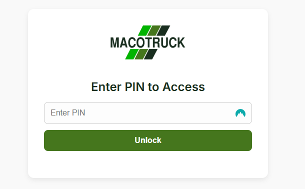
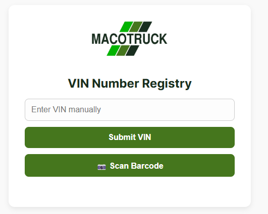

# vin-matcher

https://javierbgarcia.github.io/vin-matcher/?v=2

# VIN Matcher App

A secure, mobile-friendly web application for scanning and validating VIN (Vehicle Identification Number) codes using Google Sheets as a backend.

 

---

## 🚀 What It Does

This app allows drivers to:

- Log in securely using a personal PIN code
- Scan vehicle VINs via camera or enter them manually
- Automatically match the VIN against a database stored in Google Sheets
- Record:
  - Match status
  - Timestamp
  - Driver name (based on PIN)

All data is saved directly into a Google Sheet — no backend servers required.

---

## 🔐 Security

- PIN codes are managed via the `Settings` tab in the connected Google Sheet
- Each PIN corresponds to a driver name
- Only users with valid PINs can access the app
- PINs are stored securely and not exposed in the frontend

---

## 🗂 Structure

- `index.html`: Main frontend interface (hosted on GitHub Pages)
- Google Apps Script:
  - Validates PIN
  - Matches VINs and updates the database sheet
- Google Sheets:
  - `database` sheet stores VIN records
  - `Settings` sheet stores PIN-driver associations

---

## 📋 How to Use

1. **Go to the web app**: [https://yourusername.github.io/vin-matcher](https://yourusername.github.io/vin-matcher)
2. Enter your **PIN**
3. Scan or enter a VIN code
4. If matched:
   - You’ll receive confirmation
   - The match is recorded along with your name and timestamp
5. If already picked up or not found, an appropriate message is shown

---

## 📊 Google Sheet Layout

### `Settings` Sheet
| Column A (PIN) | Column B (Driver Name) |
|----------------|------------------------|
| 1234           | John Doe               |
| 5678           | Jane Smith             |

### `database` Sheet
| VIN            | Status   | Timestamp           | Driver Name |
|----------------|----------|---------------------|--------------|
| 1HGCM82633A004352 | Matched  | 2025-04-06 14:23     | John Doe     |

---

## 🛠 Tech Stack

- **Frontend**: HTML, CSS, JavaScript, QuaggaJS / Html5-Qrcode
- **Backend**: Google Apps Script (deployed as a Web App)
- **Database**: Google Sheets
- **Hosting**: GitHub Pages (free and fast)

---

## 📅 Roadmap (Suggestions)

- Add log history for each VIN
- Export matched VINs to PDF or CSV
- Dark mode toggle
- Role-based permissions (e.g., admin-only view)
- Bulk VIN import

---

## 👨‍💻 Created by

Built by [Javier García](https://github.com/javierbgarcia) for internal use at Macotruck and similar operations where fast and lightweight VIN tracking is needed.

---
